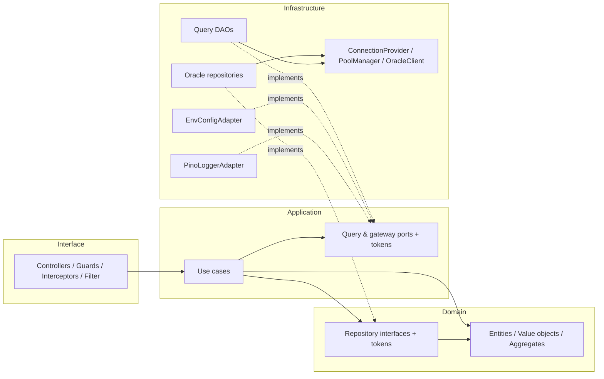
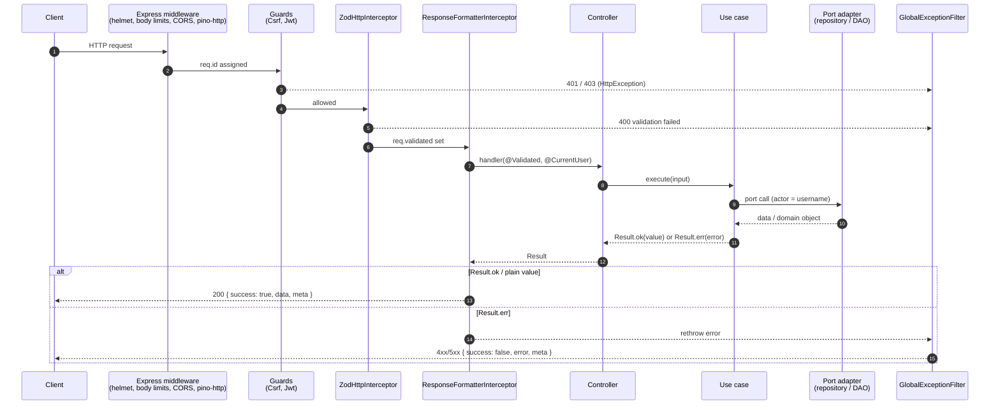
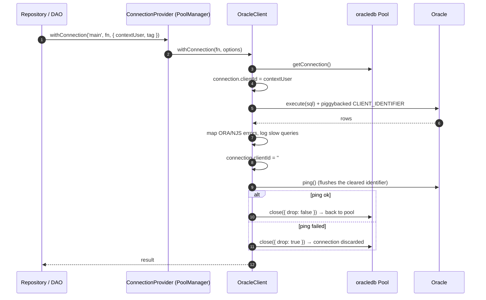
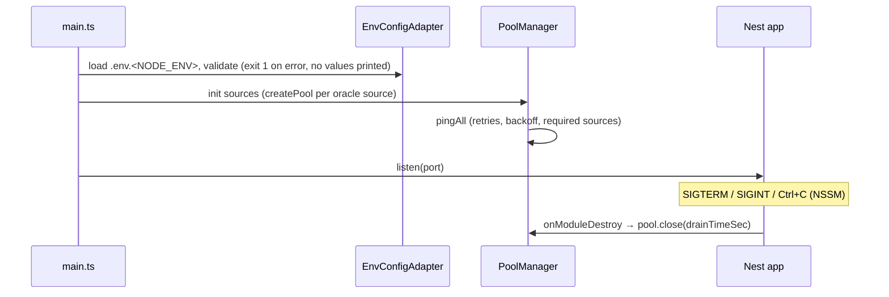

# Diagrams

## Layers and dependency direction

Solid arrows are imports. Dotted arrows are "implements": infrastructure depends on the interfaces, never the reverse.

## HTTP request

## Database call with context user

## Startup and shutdown

